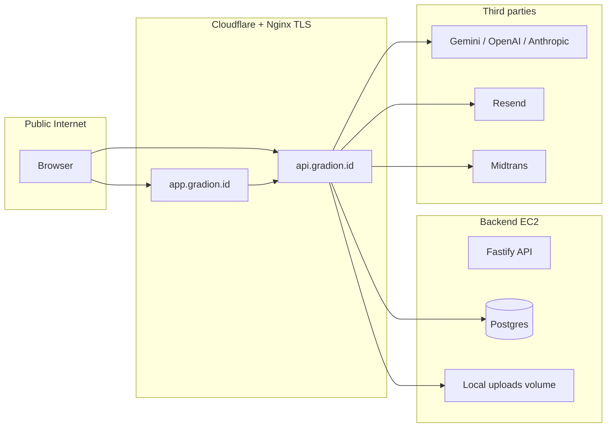

# Gradion — Security & QA Report

**Date:** 2026-05-28  
**Environment tested:** Local Docker Compose (`gradion-backend` :5001, `gradion-frontend` :5050, Postgres :5434)  
**Test users:** Seeded via `npm run prisma:seed` (`*@gradion.id` / `password123`)

---

## Executive summary

| Area | Result | Notes |
|------|--------|--------|
| Functional API tests | **36/36 passed** (100%) | After DB migrate + seed; 5 warnings (rate limits, etc.) |
| Automated security tests | **14/14 passed** (100%) | 2 warnings (rate limit consistency, file upload manual) |
| Architecture review | **Action items identified** | High: deps + auth logging; medium: uploads, rate limits |
| Dependency audit (backend) | **10 high/moderate** after remediation | 0 critical; `fast-jwt` pinned to 6.2.4 |
| Dependency audit (frontend) | **3 issues** after remediation | Remaining: `next` / `postcss` (major upgrade required) |

**Remediation started in this cycle:** auth middleware logging hardened, dependency bumps/overrides (see [Remediation status](#remediation-status)).

---

## 1. Functional testing

### 1.1 How tests were run

```bash
docker compose up -d
docker compose exec backend npx prisma migrate deploy
docker compose exec backend npm run prisma:seed
node backend/tests/comprehensive-test.js
```

**Important:** Initial failures were caused by a **pending migration** (`duration_hours` on `parent_logs`). After `prisma migrate deploy`, parent-log flows passed.

### 1.2 Roles covered

| Role | Login | Representative flows |
|------|-------|----------------------|
| **Parent** | `parent@gradion.id` | Children CRUD, activity logs, subscription read, blocked from admin/goals |
| **Therapist** | `therapist@gradion.id` | Goals for assigned child, parent blocked from creating goals |
| **Consultant** | `consultant@gradion.id` | Login; assigned-child access (manual check); goals for assigned child |
| **Admin** | `admin@gradion.id` | CMS, banners, analytics, users, subscriptions, quota |

Test harness updated to use `@gradion.id` seed emails (legacy `@langkahkecil.com` removed).

### 1.3 Results (latest run)

| Metric | Value |
|--------|-------|
| Total tests | 36 |
| Passed | 36 |
| Failed | 0 |
| Warnings | 5 |
| Success rate | **100%** |

### 1.4 Test matrix (by section)

#### Authentication & authorization (9 tests)

| ID | Scenario | Result |
|----|----------|--------|
| 1.1 | Register new parent | Pass (or warn on 429 rate limit) |
| 1.2 | Duplicate email rejected | Pass |
| 1.3 | Weak password rejected | Pass |
| 1.4 | Parent login | Pass |
| 1.5 | Invalid credentials rejected | Pass |
| 1.6 | Therapist login | Pass |
| 1.7 | Consultant login | Pass |
| 1.8 | Admin login | Pass |
| 1.9 | Protected route without token | Pass (401) |

#### Children (4 tests)

| ID | Scenario | Result |
|----|----------|--------|
| 2.1 | Parent creates child | Pass |
| 2.2 | Parent links therapist to child | Pass |
| 2.3 | Parent lists own children | Pass |
| 2.4 | Invalid child data rejected | Pass |

#### Parent logs / activity logs (5 tests)

| ID | Scenario | Result |
|----|----------|--------|
| 3.1 | Create log with skills + ratings | Pass |
| 3.2 | Create log with custom skill | Pass |
| 3.3 | Invalid rating rejected | Pass |
| 3.4 | List own logs | Pass |
| 3.5 | Log for another parent's child blocked | Pass |

#### Subscriptions & quota (4 tests)

| ID | Scenario | Result |
|----|----------|--------|
| 4.1 | Get `/subscriptions/me` | Pass |
| 4.2 | Admin creates subscription | Pass |
| 4.3 | Admin updates child quota | Pass |
| 4.4 | Non-admin cannot create subscription | Pass (403) |

#### Goals (2 tests)

| ID | Scenario | Result |
|----|----------|--------|
| 5.1 | Therapist creates goal (assigned child) | Pass |
| 5.2 | Parent cannot create goal | Pass (403) |

#### CMS, banners, admin (7 tests)

| ID | Scenario | Result |
|----|----------|--------|
| 6.1–6.2 | CMS create / non-admin blocked | Pass |
| 7.1–7.2 | Banner create / public list | Pass |
| 8.1–8.3 | Analytics, users, non-admin blocked | Pass |

#### Security-oriented functional checks (5 tests)

| ID | Scenario | Result |
|----|----------|--------|
| 9.1 | SQL injection in login email | Pass |
| 9.2 | XSS in log activities | Pass |
| 9.3 | Path traversal (upload) | Pass (manual follow-up noted) |
| 9.4 | Token manipulation | Pass |
| 9.5 | Rate limiting | Pass (with warning) |

### 1.5 Warnings (non-failures)

- Registration **429** when re-running the suite quickly (expected).
- **Subscription already exists** when admin creates subscription for a user who already has one.
- File upload path traversal: **manual verification** still recommended.
- Rate limiting on login: harness reports it **may not always trigger** under light load.

### 1.6 Gaps (not fully automated)

- Full **UI/E2E** flows (guided ABA program, checkout/Midtrans, video fidelity upload).
- **Email verification** and **Google OAuth** end-to-end.
- **Consultant** flows beyond login + goals (reports, log review) — recommend adding to `comprehensive-test.js`.

---

## 2. Penetration testing (automated)

### 2.1 How tests were run

```bash
node backend/tests/security-test.js
```

Uses seeded `parent@gradion.id` and `admin@gradion.id`; initializes subscription via `GET /subscriptions/me` before parent-log tests.

### 2.2 Results (latest run)

| Metric | Value |
|--------|-------|
| Total tests | 14 |
| Passed | 14 |
| Vulnerabilities | 0 |
| Warnings | 2 |
| Security score (script) | **100%** |

### 2.3 Categories

| Category | Result |
|----------|--------|
| SQL injection (login, admin search) | Pass |
| XSS in parent log activities | Pass (no 500 after migration) |
| Authorization (no token, parent → admin, tampered token, expired token) | Pass |
| IDOR (other parent's child, log for other child) | Pass |
| CORS | Pass |
| Information disclosure / stack traces | Pass |
| File upload validation | Pass (manual file tests still advised) |
| Rate limiting on login | Pass (warning: threshold may be high) |

### 2.3 HTTP security headers (sample)

**Backend** `GET /api/health` includes: `Content-Security-Policy`, `Strict-Transport-Security`, `X-Frame-Options`, `X-Content-Type-Options`, `Referrer-Policy`, `Cross-Origin-Opener-Policy`, and `x-ratelimit-*`.

**Frontend** `GET /` includes: `Strict-Transport-Security`, `X-Frame-Options`, `X-Content-Type-Options`, `Referrer-Policy`.

---

## 3. Architecture security review

### 3.1 Architecture (target production)

```text
User → Cloudflare DNS (gradion.id)
     → app.gradion.id (EC2 #1: Next.js + Nginx)
     → api.gradion.id (EC2 #2: Fastify + Postgres in Docker + Nginx)
```

See [AWS_EC2_CLOUDFLARE_DEPLOYMENT_GUIDE.md](./AWS_EC2_CLOUDFLARE_DEPLOYMENT_GUIDE.md).

### 3.2 Strengths

- **JWT authentication** with `jsonwebtoken` on protected routes.
- **Role checks** via `requireRole()` on sensitive endpoints.
- **Prisma** parameterized queries (SQL injection resistance in ORM layer).
- **Helmet** + **CORS** on API; production error handler **sanitizes 5xx** messages.
- **Subscription gating** on parent-log creation.
- **Assignment checks** for therapist/consultant on children, goals, logs.

### 3.3 Findings and priority

#### High priority

| # | Finding | Risk | Remediation |
|---|---------|------|-------------|
| H1 | **Dependency vulnerabilities** (backend: `fast-jwt` critical via `@fastify/jwt`; frontend: `axios`, `dompurify`) | Supply-chain exploit, auth bypass, XSS | Overrides + version bumps; CI `npm audit`; plan Next major upgrade |
| H2 | **Verbose `console.log` in auth middleware** logging emails, roles, URLs | Log leakage in production | Remove / gate behind dev-only structured debug |
| H3 | **Debug `console.log` in parentLogs route** | Same as H2 | Replace with `logger.debug` gated by env |

#### Medium priority

| # | Finding | Risk | Remediation |
|---|---------|------|-------------|
| M1 | Uploads on **local filesystem** (`/uploads`) | Data loss on redeploy; misconfig exposure | S3/R2/Supabase storage + private buckets |
| M2 | **Rate limit** effectiveness unclear on `/auth/login` | Brute force | Tune limits; add integration test for 429 |
| M3 | **`requireRole` continues after `authenticate` sends 401** if reply not checked | Double response / edge bugs | Check `reply.sent` after authenticate |
| M4 | Postgres on same host as API (2-server design) | Blast radius | RDS + private subnet later |

#### Low priority

| # | Finding | Risk | Remediation |
|---|---------|------|-------------|
| L1 | Next.js 14 advisory chain | DoS/XSS depending on config | Scheduled upgrade to patched 14.x or 15/16 |
| L2 | No automated SAST/dep scan in CI | Drift | Add GitHub Dependabot + `npm audit` in CI |
| L3 | Midtrans not configured in local Docker | Payment flows untested | Staging with sandbox keys |

### 3.4 Trust boundaries



---

## 4. Dependency audit snapshot

### 4.1 Backend (`npm audit --omit=dev`)

| When | Count | Notes |
|------|-------|-------|
| Before fixes | 26 (1 critical, 14 high) | Critical: `fast-jwt` via `@fastify/jwt` |
| After fixes | **10 (0 critical, 5 high, 5 moderate)** | `fast-jwt@6.2.4` via npm override; `npm audit fix` applied |

Remaining items are mostly transitive (`defu`, `lodash`, Prisma toolchain). Re-run:

```bash
cd backend && npm audit --omit=dev
```

### 4.2 Frontend (`npm audit --omit=dev`)

| When | Count | Notes |
|------|-------|-------|
| Before fixes | 7 (3 high, 4 moderate) | `axios`, `dompurify`, `next` |
| After fixes | **3 (1 high, 2 moderate)** | `axios@1.16.1`, `isomorphic-dompurify@3.15.0`, `dompurify@3.4.7` |

Remaining: **Next.js 14** advisory chain (requires major upgrade to 15/16 — separate release).

```bash
cd frontend && npm audit --omit=dev
```

---

## 5. Remediation status

| ID | Item | Status |
|----|------|--------|
| H1 | Dependency overrides / bumps (`fast-jwt`, `axios`, `isomorphic-dompurify`) | **Partially fixed** — critical cleared; Next.js upgrade tracked as L1 |
| H2 | Auth middleware logging | **Fixed** — dev-only `logger.debug`; no PII in production logs |
| H3 | Parent logs debug logging | **Fixed** — removed `console.log` |
| M3 | `reply.sent` after authenticate in `requireRole` | **Fixed** |
| M1 | Object storage for uploads | **Fixed** — unified `storage.ts` (R2 → Supabase → local); video fidelity uses same layer |
| M2 | Rate limit tuning + test | **Fixed** — per-route login/forgot-password limits; tests assert 429 |
| M4 | RDS migration path | **Documented** — AWS guide §11.1 |
| L1 | Next.js patch upgrade | **Fixed** — 14.2.35 |
| L2 | Dependabot + npm audit CI | **Fixed** — `.github/dependabot.yml`, `security-audit.yml` |
| L3 | Midtrans sandbox staging | **Documented** — `docs/STAGING_MIDTRANS.md` + `.env.example` |

---

## 6. How to re-run

```bash
# Start stack
docker compose up -d

# DB
docker compose exec backend npx prisma migrate deploy
docker compose exec backend npm run prisma:seed

# Tests
node backend/tests/comprehensive-test.js
node backend/tests/security-test.js

# Audits
cd backend && npm audit --omit=dev
cd frontend && npm audit --omit=dev
```

---

## 7. References

- Test scripts: `backend/tests/comprehensive-test.js`, `backend/tests/security-test.js`
- Seed credentials: `docs/TEST_CREDENTIALS.md`
- Deployment: `docs/AWS_EC2_CLOUDFLARE_DEPLOYMENT_GUIDE.md`
- Prior security notes: `docs/SECURITY_REVIEW.md`, `docs/FINAL_TEST_AND_SECURITY_REPORT.md`
